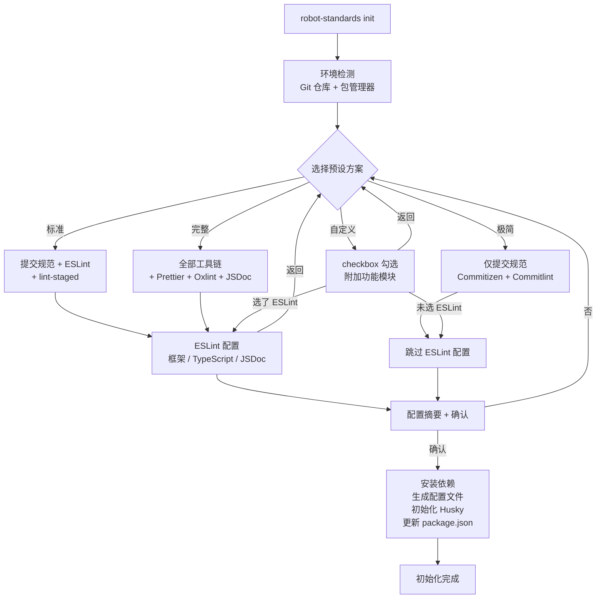

# @robot-admin/git-standards

> **v1.0.1** · 零配置 · 模块化 · Git 工程化标准工具包

集成 Commitizen + Commitlint + Husky + ESLint + Prettier + Oxlint + lint-staged，支持按需选配。

## 快速开始

```bash
# 安装（workspace 项目）
bun add --dev @robot-admin/git-standards

# 初始化（交互式引导）
node node_modules/@robot-admin/git-standards/bin/robot-standards.js init
```

运行后进入交互式引导，选择预设方案即可完成全部配置。

> **注意**：所有配置文件生成后即为完整独立文件，不依赖本包的运行时导入，直接修改即可自定义。

## 提交代码

初始化完成后，有两种方式唤醒规范化提交：

```bash
# 方式一：通过 package.json scripts（无需全局安装）
bun run cz
npm run cz

# 方式二：通过 git 子命令（需全局安装 commitizen）
npm install -g commitizen
git cz
```

两种方式效果完全一致，都会唤醒交互式提交：

```
? 请选择提交类型:  fix: 🐛 Bug 修复
? 请输入修改范围:  登录
? 请简要描述提交:  修复登录相关逻辑
→ fix(登录): 修复登录相关逻辑
```

## 预设模式

| 模式       | 包含功能                              | 依赖数 | 适用场景                                        |
| ---------- | ------------------------------------- | ------ | ----------------------------------------------- |
| **极简**   | Commitizen + Commitlint + Husky       | ~5     | 只需规范提交信息                                |
| **标准**   | + ESLint + lint-staged + EditorConfig | ~10    | 需要代码质量检查                                |
| **完整**   | + Prettier + Oxlint + JSDoc（全部）   | ~16    | 全面代码质量管控，主项目 Robot_Admin 使用此模式 |
| **自定义** | checkbox 自由勾选                     | 按需   | 精确控制每个功能模块                            |

### 极简模式

仅安装 Git 提交规范工具链，不涉及任何代码检查/格式化：

- ✔ Commitizen + cz-customizable（规范提交交互）
- ✔ Commitlint（提交信息校验）
- ✔ Husky commit-msg hook
- ✗ 无 pre-commit hook
- ✗ 无 ESLint / Prettier / lint-staged

### 标准模式

在极简基础上增加代码质量检查：

- ✔ 极简模式全部功能
- ✔ ESLint（支持 Vue 3 / React / Vanilla）
- ✔ lint-staged（暂存区增量检查）
- ✔ Husky pre-commit hook
- ✔ EditorConfig

### 完整模式

全部工具链，与 Robot_Admin 主项目一致：

- ✔ 标准模式全部功能
- ✔ Prettier（代码自动格式化）
- ✔ Oxlint（50x faster Lint 引擎）
- ✔ JSDoc 强制注释（默认启用）

### 自定义模式

通过 checkbox 逐一勾选需要的功能模块：

```
ESLint           代码质量检查
lint-staged      暂存区增量检查
Prettier         代码自动格式化
Oxlint           高性能 Lint 引擎
EditorConfig     编辑器统一配置
↩ 返回上一步
```

> Commitizen + Commitlint + Husky 为核心功能，始终包含。

## 交互流程



## CI / 非交互模式

通过 `--ci` 跳过交互，配合 `--preset` 指定预设：

```bash
# 极简模式
robot-standards init --ci --preset minimal

# 标准模式（默认）
robot-standards init --ci --preset standard

# 完整模式
robot-standards init --ci --preset full

# 完整模式 + 自定义选项
robot-standards init --ci --preset full --framework react --typescript --no-jsdoc
```

### CLI 参数

| 参数               | 说明                                   | 默认值           |
| ------------------ | -------------------------------------- | ---------------- |
| `--cwd <path>`     | 目标目录                               | 当前目录         |
| `--ci`             | 非交互式模式                           | `false`          |
| `--preset <id>`    | 预设方案 `minimal \| standard \| full` | `standard`       |
| `--framework <fw>` | 项目框架 `vue \| react \| vanilla`     | `vue`            |
| `--typescript`     | 启用 TypeScript                        | CI 模式下 `true` |
| `--jsdoc`          | 强制 JSDoc 注释                        | full 时 `true`   |
| `--oxlint`         | 启用 Oxlint                            | 跟随预设         |
| `--prettier`       | 启用 Prettier                          | 跟随预设         |

## 配置自定义

所有生成的文件都是**完整独立的配置**，不依赖本包的任何运行时导入。直接修改文件即可：

### ESLint — eslint.config.ts

```ts
// 生成后直接在规则对象里增删改即可
export default defineConfigWithVueTs(
  // ...已有配置

  // 新增项目专属忽略
  {
    name: "app/files-to-ignore",
    ignores: [
      "**/dist/**",
      "**/src/api/generated/**", // 按需添加
    ],
  },

  // 新增自定义规则
  {
    rules: {
      "no-console": ["error", { allow: ["warn", "error"] }],
    },
  },
);
```

### Commitizen — .cz-config.js

```js
// 直接改 types / scopes / messages
module.exports = {
  scopes: [{ name: "core" }, { name: "ui" }],
  types: [
    // 增加自定义类型...
  ],
};
```

### Prettier — .prettierrc.js

```js
// 直接改任意选项
module.exports = {
  printWidth: 100, // 默认 80，改为 100
  semi: true, // 默认 false，改为 true
};
```

### Commitlint — commitlint.config.js

```js
// 增加自定义 type 或调整规则
module.exports = {
  extends: ["@commitlint/config-conventional"],
  rules: {
    "type-enum": [
      2,
      "always",
      [
        // 在这里增删 type...
      ],
    ],
    "header-max-length": [2, "always", 120],
  },
};
```

## 生成的文件清单

| 文件                   | 极简 | 标准 | 完整 | 说明                    |
| ---------------------- | :--: | :--: | :--: | ----------------------- |
| `.cz-config.js`        |  ✔   |  ✔   |  ✔   | Commitizen 提交类型配置 |
| `commitlint.config.js` |  ✔   |  ✔   |  ✔   | 提交信息校验规则        |
| `.husky/commit-msg`    |  ✔   |  ✔   |  ✔   | 提交信息 hook           |
| `.husky/pre-commit`    |  -   |  ✔   |  ✔   | 代码检查 hook           |
| `eslint.config.ts`     |  -   |  ✔   |  ✔   | ESLint Flat Config      |
| `.editorconfig`        |  -   |  ✔   |  ✔   | 编辑器统一配置          |
| `.prettierrc.js`       |  -   |  -   |  ✔   | 代码格式化配置          |

### 各文件内容详解

#### `.cz-config.js` — Commitizen 交互式提交配置

定义了 `git cz` 交互式提交的类型、消息模板和作用域。

**生成内容**:

```js
module.exports = {
  scopes: [], // 默认空，可自定义添加预设 scope
  allowEmptyScopes: false, // 不允许空 scope
  allowCustomScopes: true, // 允许自由输入 scope

  types: [
    { value: "wip", name: "wip:      🚧 开发中" },
    { value: "feat", name: "feat:     🎯 新功能" },
    { value: "fix", name: "fix:      🐛 Bug 修复" },
    { value: "perf", name: "perf:     ⚡️ 性能优化" },
    { value: "deps", name: "deps:     📦 依赖更新" },
    { value: "refactor", name: "refactor: ♻️  重构" },
    { value: "docs", name: "docs:     📚 文档变更" },
    { value: "test", name: "test:     🔎 测试相关" },
    { value: "style", name: "style:    💄 代码样式" },
    { value: "build", name: "build:    🧳 构建/打包" },
    { value: "chore", name: "chore:    🔧 其他杂项" },
    { value: "revert", name: "revert:   🔙 回退" },
  ],

  messages: {
    type: "请选择提交类型:",
    customScope: "请输入修改范围(必填，格式如：模块/子模块):",
    subject: "请简要描述提交(必填，不加句号):",
    body: "请输入更详细的说明(可选):\n",
    footer: 'Footer(可选): 例如 "Closes #123" 或 "Release-As: 1.3.1"\n',
    confirmCommit: "确认提交以上内容？(y/n/e/h)",
  },

  skipQuestions: ["body"],
  allowBreakingChanges: ["feat", "fix", "refactor"],
  breakingPrefix: "BREAKING CHANGE:",
  subjectLimit: 88,
};
```

---

#### `commitlint.config.js` — 提交信息校验规则

校验 `git commit` 消息是否符合约定式提交规范。

**生成内容**:

```js
module.exports = {
  extends: ["@commitlint/config-conventional"],
  rules: {
    "type-enum": [
      2,
      "always",
      [
        "wip",
        "feat",
        "fix",
        "perf",
        "deps",
        "refactor",
        "docs",
        "test",
        "style",
        "build",
        "chore",
        "revert",
      ],
    ],
    "type-case": [2, "always", "lower-case"],
    "subject-empty": [2, "never"],
    "type-empty": [2, "never"],
    "subject-full-stop": [0, "never"],
    "header-max-length": [2, "always", 88],
  },
};
```

---

#### `.husky/commit-msg` — 提交信息校验 Hook

Git commit 时自动触发，校验提交信息格式是否合规。

**生成内容**:

```shell
bunx --no-install commitlint --edit "$1"
```

> 执行命令因包管理器不同而异（`bunx` / `npx` / `pnpm exec`）

---

#### `.husky/pre-commit` — 代码质量检查 Hook

Git commit 前自动触发，根据启用功能动态生成。

**极简模式**: 无此文件

**标准模式**（ESLint + lint-staged）:

```shell
bunx lint-staged
```

**完整模式**（Oxlint + lint-staged）:

```shell
bunx oxlint --max-warnings 0
bunx lint-staged
```

> 文件会自动设置可执行权限（`chmod 755`），确保在 Git Bash / WSL 环境下正常运行。

---

#### `eslint.config.ts` — ESLint Flat Config

根据框架（Vue/React/Vanilla）、TypeScript、JSDoc 选项动态生成。

**Vue 3 + TypeScript 示例**:

```ts
import pluginVue from "eslint-plugin-vue";
import vueTsConfigs from "@vue/eslint-config-typescript";
import skipFormatting from "@vue/eslint-config-prettier/skip-formatting";
import oxlint from "eslint-plugin-oxlint"; // 完整模式
import jsdocPlugin from "eslint-plugin-jsdoc"; // 启用 JSDoc 时
import { defineConfigWithVueTs } from "@vue/eslint-config-typescript";

export default defineConfigWithVueTs(
  { name: "app/files-to-lint", files: ["**/*.{ts,mts,tsx,vue}"] },
  { name: "app/files-to-ignore", ignores: ["**/dist/**", "**/coverage/**"] },

  ...oxlint.configs["flat/recommended"], // Oxlint 基础规则
  pluginVue.configs["flat/essential"], // Vue 规则
  vueTsConfigs.recommended, // TS 规则

  {
    rules: {
      "no-undef": "off",
      "@typescript-eslint/no-explicit-any": "off",
      "vue/multi-word-component-names": ["error", { ignores: ["index"] }],
      // ... 更多规则
    },
  },
  skipFormatting,
);
```

**核心规则覆盖**: 每种框架预设都包含合理的默认规则，支持直接修改。

---

#### `.editorconfig` — 编辑器统一配置

统一团队成员的编辑器缩进、换行等基础格式。

**生成内容**:

```ini
root = true

[*]
charset = utf-8
indent_style = space
indent_size = 2
end_of_line = lf
insert_final_newline = true
trim_trailing_whitespace = true

[*.md]
trim_trailing_whitespace = false

[*.{yml,yaml}]
indent_size = 2

[Makefile]
indent_style = tab
```

---

#### `.prettierrc.js` — Prettier 格式化配置

代码自动格式化规则，仅完整模式生成。

**生成内容**:

```js
module.exports = {
  singleQuote: true,
  semi: false,
  printWidth: 80,
  trailingComma: "all",
  arrowParens: "avoid",
  endOfLine: "auto",
};
```

---

### package.json 自动变更

init 同时更新 `package.json` 中的以下字段：

| 字段                | 极简 | 标准 | 完整 | 内容                           |
| ------------------- | :--: | :--: | :--: | ------------------------------ |
| `scripts.cz`        |  ✔   |  ✔   |  ✔   | `"git-cz"`                     |
| `scripts.prepare`   |  ✔   |  ✔   |  ✔   | `"husky"`                      |
| `scripts.lint`      |  -   |  ✔   |  ✔   | `"eslint . --fix"` 或含 oxlint |
| `scripts.format`    |  -   |  -   |  ✔   | `"prettier --write src/"`      |
| `config.commitizen` |  ✔   |  ✔   |  ✔   | cz-customizable 路径           |
| `lint-staged`       |  -   |  ✔   |  ✔   | 暂存区检查规则                 |

**lint-staged 配置示例**（完整模式）:

```jsonc
{
  "lint-staged": {
    "src/**/*.{js,jsx,ts,tsx,vue}": [
      "oxlint --max-warnings 0 --deny-warnings",
      "eslint --fix --no-cache",
      "prettier --write"
    ],
    "*.{json,md,yml,yaml}": ["prettier --write"]
  }
}
```

## Git 提交完整流程

```
bun run cz / git cz
    │
    ▼
.cz-config.js → 交互式选类型、填 scope、写描述
    │
    ▼
git commit（由 commitizen 触发）
    │
    ├─ .husky/pre-commit 触发:
    │   1. oxlint --max-warnings 0     ← 快速全量 lint
    │   2. lint-staged                 ← 增量检查暂存文件
    │       ├─ oxlint --deny-warnings
    │       ├─ eslint --fix --no-cache
    │       └─ prettier --write
    │
    ├─ .husky/commit-msg 触发:
    │   commitlint --edit "$1"         ← 校验提交信息格式
    │
    ▼
提交成功 ✅
```

## Doctor 诊断

检查当前项目的 Git 标准化配置状态：

```bash
node node_modules/@robot-admin/git-standards/bin/robot-standards.js doctor
```

智能检测已安装的功能模块，未安装的功能标记为 `○ 未启用` 而非失败：

```
  核心功能

  ✔ Git 仓库
  ✔ Husky 目录
  ✔ commit-msg hook
  ✔ Commitlint 配置
  ✔ Commitizen 配置
  ✔ cz 脚本

  已启用的功能

  ✔ ESLint 配置
  ✔ Prettier 配置
  ✔ lint-staged 配置
  ✔ pre-commit hook

  未启用的功能

  ○ EditorConfig
```

## 故障排除 (Troubleshooting)

### Husky Hooks 未执行

**问题现象**: 提交代码时没有触发 lint 检查，直接提交成功

**可能原因**: Git Bash / WSL 环境下，hook 文件缺少执行权限

**解决方案**:

```bash
# 检查 hook 文件权限
ls -la .husky/pre-commit .husky/commit-msg

# 如果没有 x 权限（应该显示 -rwxr-xr-x 而非 -rw-r--r--），执行：
chmod +x .husky/pre-commit .husky/commit-msg

# 验证修复
ls -la .husky/
```

**预防措施**: 初始化后立即检查权限

```bash
# 在 init 完成后执行
chmod +x .husky/*
```

### Commitizen 提示 "git-cz command not found"

**解决方案**:

```bash
# 方式一：使用 npm scripts（推荐）
npm run cz
bun run cz

# 方式二：全局安装
npm install -g commitizen
```

### lint-staged 报错 "Cannot find module"

**原因**: 依赖安装不完整

**解决方案**:

```bash
# 重新安装依赖
rm -rf node_modules
npm install

# 或使用 doctor 检查缺失的依赖
node node_modules/@robot-admin/git-standards/bin/robot-standards.js doctor
```

### ESLint Flat Config 不生效

**原因**: 项目中同时存在旧版 `.eslintrc.*` 文件

**解决方案**:

```bash
# 删除旧配置文件（保留 eslint.config.ts）
rm .eslintrc.js .eslintrc.json .eslintrc.yml
```

### Windows 下 Husky 不工作

**原因**: Git 配置的 core.hooksPath 可能被覆盖

**解决方案**:

```bash
# 检查 Git 配置
git config core.hooksPath

# 如果不是 .husky，重置它
git config --unset core.hooksPath
npm run prepare  # 重新初始化 husky
```

## License

MIT
