# @robot-admin/git-standards

零配置 · 模块化 · Git 工程化标准工具包

集成 Commitizen + Commitlint + Husky + ESLint + Prettier + Oxlint + lint-staged，支持按需选配。

## 快速开始

```bash
# 安装（workspace 项目）
bun add --dev @robot-admin/git-standards

# 初始化（交互式引导）
node node_modules/@robot-admin/git-standards/bin/robot-standards.js init
```

运行后进入交互式引导，选择预设方案即可完成全部配置。

> **注意**：所有配置文件生成后即为完整独立文件，不依赖本包的运行时导入，直接修改即可自定义。

## 提交代码

初始化完成后，有两种方式唤醒规范化提交：

```bash
# 方式一：通过 package.json scripts（无需全局安装）
bun run cz
npm run cz

# 方式二：通过 git 子命令（需全局安装 commitizen）
npm install -g commitizen
git cz
```

两种方式效果完全一致，都会唤醒交互式提交：

```
? 请选择提交类型:  fix: 🐛 Bug 修复
? 请输入修改范围:  登录
? 请简要描述提交:  修复登录相关逻辑
→ fix(登录): 修复登录相关逻辑
```

## 预设模式

| 模式       | 包含功能                              | 依赖数 | 适用场景                                        |
| ---------- | ------------------------------------- | ------ | ----------------------------------------------- |
| **极简**   | Commitizen + Commitlint + Husky       | ~5     | 只需规范提交信息                                |
| **标准**   | + ESLint + lint-staged + EditorConfig | ~10    | 需要代码质量检查                                |
| **完整**   | + Prettier + Oxlint + JSDoc（全部）   | ~16    | 全面代码质量管控，主项目 Robot_Admin 使用此模式 |
| **自定义** | checkbox 自由勾选                     | 按需   | 精确控制每个功能模块                            |

### 极简模式

仅安装 Git 提交规范工具链，不涉及任何代码检查/格式化：

- ✔ Commitizen + cz-customizable（规范提交交互）
- ✔ Commitlint（提交信息校验）
- ✔ Husky commit-msg hook
- ✗ 无 pre-commit hook
- ✗ 无 ESLint / Prettier / lint-staged

### 标准模式

在极简基础上增加代码质量检查：

- ✔ 极简模式全部功能
- ✔ ESLint（支持 Vue 3 / React / Vanilla）
- ✔ lint-staged（暂存区增量检查）
- ✔ Husky pre-commit hook
- ✔ EditorConfig

### 完整模式

全部工具链，与 Robot_Admin 主项目一致：

- ✔ 标准模式全部功能
- ✔ Prettier（代码自动格式化）
- ✔ Oxlint（50x faster Lint 引擎）
- ✔ JSDoc 强制注释（默认启用）

### 自定义模式

通过 checkbox 逐一勾选需要的功能模块：

```
ESLint           代码质量检查
lint-staged      暂存区增量检查
Prettier         代码自动格式化
Oxlint           高性能 Lint 引擎
EditorConfig     编辑器统一配置
↩ 返回上一步
```

> Commitizen + Commitlint + Husky 为核心功能，始终包含。

## 交互流程

```mermaid
flowchart TD
    A["robot-standards init"] --> B["环境检测<br/>Git 仓库 + 包管理器"]
    B --> C{"选择预设方案"}

    C -->|极简| D1["仅提交规范<br/>Commitizen + Commitlint"]
    C -->|标准| D2["提交规范 + ESLint<br/>+ lint-staged"]
    C -->|完整| D3["全部工具链<br/>+ Prettier + Oxlint + JSDoc"]
    C -->|自定义| D4["checkbox 勾选<br/>附加功能模块"]

    D1 --> SKIP["跳过 ESLint 配置"]
    D2 --> ESLINT["ESLint 配置<br/>框架 / TypeScript / JSDoc"]
    D3 --> ESLINT
    D4 -->|"选了 ESLint"| ESLINT
    D4 -->|"未选 ESLint"| SKIP
    D4 -->|"返回"| C

    ESLINT --> SUMMARY["配置摘要 + 确认"]
    ESLINT -->|"返回"| C
    SKIP --> SUMMARY

    SUMMARY -->|确认| EXEC["安装依赖<br/>生成配置文件<br/>初始化 Husky<br/>更新 package.json"]
    SUMMARY -->|否| C

    EXEC --> DONE["初始化完成"]
```



## CI / 非交互模式

通过 `--ci` 跳过交互，配合 `--preset` 指定预设：

```bash
# 极简模式
robot-standards init --ci --preset minimal

# 标准模式（默认）
robot-standards init --ci --preset standard

# 完整模式
robot-standards init --ci --preset full

# 完整模式 + 自定义选项
robot-standards init --ci --preset full --framework react --typescript --no-jsdoc
```

### CLI 参数

| 参数               | 说明                                   | 默认值           |
| ------------------ | -------------------------------------- | ---------------- |
| `--cwd <path>`     | 目标目录                               | 当前目录         |
| `--ci`             | 非交互式模式                           | `false`          |
| `--preset <id>`    | 预设方案 `minimal \| standard \| full` | `standard`       |
| `--framework <fw>` | 项目框架 `vue \| react \| vanilla`     | `vue`            |
| `--typescript`     | 启用 TypeScript                        | CI 模式下 `true` |
| `--jsdoc`          | 强制 JSDoc 注释                        | full 时 `true`   |
| `--oxlint`         | 启用 Oxlint                            | 跟随预设         |
| `--prettier`       | 启用 Prettier                          | 跟随预设         |

## 配置自定义

所有生成的文件都是**完整独立的配置**，不依赖本包的任何运行时导入。直接修改文件即可：

### ESLint — eslint.config.ts

```ts
// 生成后直接在规则对象里增删改即可
export default defineConfigWithVueTs(
  // ...已有配置

  // 新增项目专属忽略
  {
    name: "app/files-to-ignore",
    ignores: [
      "**/dist/**",
      "**/src/api/generated/**", // 按需添加
    ],
  },

  // 新增自定义规则
  {
    rules: {
      "no-console": ["error", { allow: ["warn", "error"] }],
    },
  },
);
```

### Commitizen — .cz-config.js

```js
// 直接改 types / scopes / messages
module.exports = {
  scopes: [{ name: "core" }, { name: "ui" }],
  types: [
    // 增加自定义类型...
  ],
};
```

### Prettier — .prettierrc.js

```js
// 直接改任意选项
module.exports = {
  printWidth: 100, // 默认 80，改为 100
  semi: true, // 默认 false，改为 true
};
```

### Commitlint — commitlint.config.js

```js
// 增加自定义 type 或调整规则
module.exports = {
  extends: ["@commitlint/config-conventional"],
  rules: {
    "type-enum": [
      2,
      "always",
      [
        // 在这里增删 type...
      ],
    ],
    "header-max-length": [2, "always", 120],
  },
};
```

## 生成的文件清单

| 文件                   | 极简 | 标准 | 完整 | 说明                    |
| ---------------------- | :--: | :--: | :--: | ----------------------- |
| `.cz-config.js`        |  ✔   |  ✔   |  ✔   | Commitizen 提交类型配置 |
| `commitlint.config.js` |  ✔   |  ✔   |  ✔   | 提交信息校验规则        |
| `.husky/commit-msg`    |  ✔   |  ✔   |  ✔   | 提交信息 hook           |
| `.husky/pre-commit`    |  -   |  ✔   |  ✔   | 代码检查 hook           |
| `eslint.config.ts`     |  -   |  ✔   |  ✔   | ESLint Flat Config      |
| `.editorconfig`        |  -   |  ✔   |  ✔   | 编辑器统一配置          |
| `.prettierrc.js`       |  -   |  -   |  ✔   | 代码格式化配置          |

## Git 提交完整流程

```
bun run cz / git cz
    │
    ▼
.cz-config.js → 交互式选类型、填 scope、写描述
    │
    ▼
git commit（由 commitizen 触发）
    │
    ├─ .husky/pre-commit 触发:
    │   1. oxlint --max-warnings 0     ← 快速全量 lint
    │   2. lint-staged                 ← 增量检查暂存文件
    │       ├─ oxlint --deny-warnings
    │       ├─ eslint --fix --no-cache
    │       └─ prettier --write
    │
    ├─ .husky/commit-msg 触发:
    │   commitlint --edit "$1"         ← 校验提交信息格式
    │
    ▼
提交成功 ✅
```

## package.json 变更

init 会自动更新 `package.json`：

```jsonc
{
  "scripts": {
    "cz": "git-cz", // 始终添加
    "prepare": "husky", // 始终添加
    "lint": "oxlint ... && eslint ...", // 仅标准/完整模式
    "format": "prettier --write src/" // 仅完整模式
  },
  "config": {
    "commitizen": { "path": "node_modules/cz-customizable" }
  },
  "lint-staged": {
    // 仅标准/完整模式
    "src/**/*.{js,jsx,ts,tsx,vue}": [
      "oxlint --max-warnings 0 --deny-warnings",
      "eslint --fix --no-cache",
      "prettier --write"
    ]
  }
}
```

## Doctor 诊断

检查当前项目的 Git 标准化配置状态：

```bash
node node_modules/@robot-admin/git-standards/bin/robot-standards.js doctor
```

智能检测已安装的功能模块，未安装的功能标记为 `○ 未启用` 而非失败：

```
  核心功能

  ✔ Git 仓库
  ✔ Husky 目录
  ✔ commit-msg hook
  ✔ Commitlint 配置
  ✔ Commitizen 配置
  ✔ cz 脚本

  已启用的功能

  ✔ ESLint 配置
  ✔ Prettier 配置
  ✔ lint-staged 配置
  ✔ pre-commit hook

  未启用的功能

  ○ EditorConfig
```

## License

MIT
